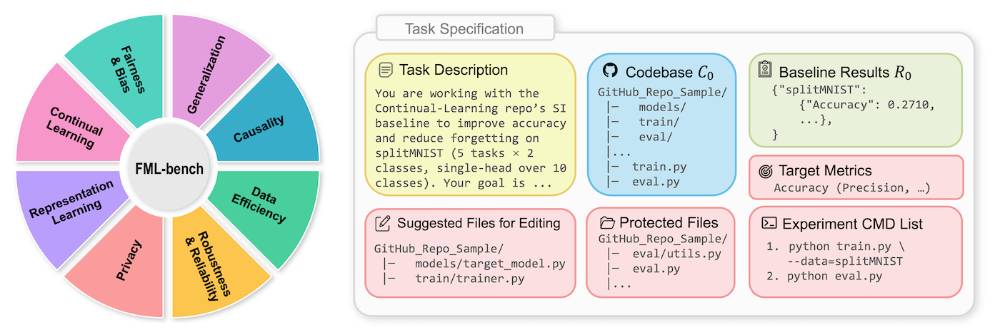
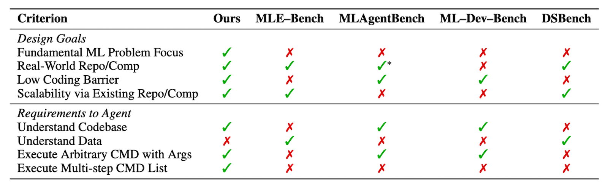
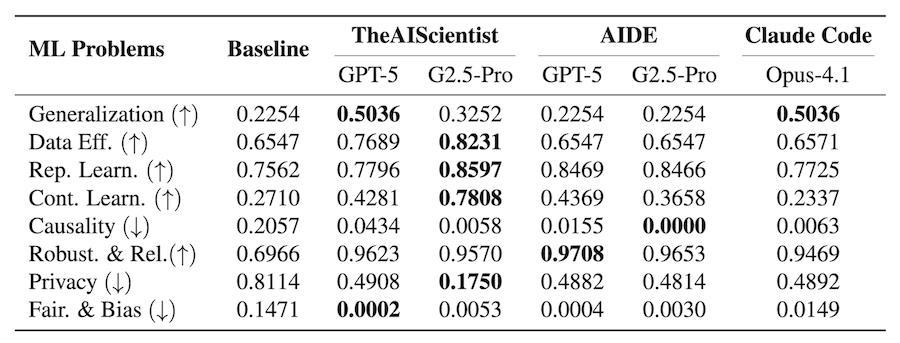

<p align="center">
  <a href="https://github.com/qrzou/FML-bench">
    
  </a>
</p>


<p align="center">
    <a href="https://arxiv.org/abs/2510.10472">
        
    </a>
    <a href="http://www.apache.org/licenses/LICENSE-2.0">
        
    </a>
</p>


Official implementation of [FML-bench: A Benchmark for Automatic ML Research Agents Highlighting the Importance of  Exploration Breadth](https://arxiv.org/abs/2510.10472)


## 🎯 Overview

FML-bench evaluates automatic ML research agents on **8 fundamental machine learning problems**. 
It focuses on evaluating agents’ scientific research capabilities rather than their performance on specific use cases or engineering tasks.

**✨ Key Features**

- **🔬 Fundamental ML Problems** - Focus on core ML research challenges rather than downstream application
- **💻 Real-world Codebases** - Direct integration with existing real-world GitHub repositories, offering more realistic challenges
- **🔧 Low Coding Barrier** - Start from baseline's codebase rather than dataset only
- **📈 Extensible by Design** - Easy to add existing real-world ML repositories with minimal adapters, enabling quick customization into user-defined benchmarks across ML and AI for Science domains

We provide agents with task specification including task description, baseline code & results, execution guidance to access guidance, and integrity-protected evaluation.
Agents are required to iteratively improve the baseline method based on the provided inputs to advance ML research!





## Quick Start


We support two approaches for running agents on our benchmark:

**👉 1. Agents without native GitHub repository capabilities**

For agents that lack built-in support for improving GitHub repositories codebase, we provide code tools that enable them to execute experiments on our benchmark. Agents can then do analysis according to the returned results.

```python
executor = BenchmarkExecutor(benchmark_config, ...)
results = executor.run_experiment(current_run_id)
```

For instance, we have extended **TheAIScientist** with additional capabilities through our code tools, allowing it to run directly on our benchmark. It can be executed directly using:

```bash
python run_agent_benchmark.py --config configs/generalization.yaml  # run TheAIScientist
```


**👉 2. Agents with native GitHub repository capabilities**

Agents like Weco (AIDE) and Claude Code, which natively support GitHub repositories, can be used directly. 
We also include scripts that wrap all tasks for easy execution on our benchmark for Weco and Claude Code.
e.g.

```bash
conda activate domainbed
cd workspace/Generalization_domainbed
source run_weco.sh  # run AIDE (Weco)
source run_claude_code.sh  # run Claude Code
```

See this [tutorial](docs/RUN_AGENTS_ON_FMLBENCH.md) for detailed instructions of running TheAIScientist, AIDE (Weco), and Claude Code.


 

## Table of Content

- [Quick Start](#quick-start)
- [Setup](#setup)
- [Run Agents on FML-bench](#run-agents-on-fml-bench)
- [Extend with Your Own Task](#extend-with-your-own-task)
- [Features & Leaderboard](#features--leaderboard)


## Setup


**1. Setup FML-bench**

Set up our benchmark conda environment as well as all 8 tasks' repositories, datasets, and conda environments. Make sure you have Anaconda/Miniconda installed before running the setup scripts.

```bash
bash ./scripts/setup_fmlbench.sh
```


**2. Setup Agents**

TheAIScientist and AIDE (Weco) are already set up as part of the FML-bench installation above.
To install Claude Code, please refer to the [official documentation](https://docs.claude.com/en/docs/claude-code/overview)

## Run Agents on FML-bench

We provide scripts wrapping all the tasks for TheAIScientist, Weco, and Claude Code to easily run on our benchmark.


**Note:**
- For detailed usage of running on single task, check corresponding script.
- Task repos need to be set to their original status before running agents. You can execute `scripts/reset_codebases.sh` to reset repos.


### TheAIScientist

The script below is for running TheAIScientist with GPT-5 and and Gemini-2.5-Pro. Change the configuration of LLM and provider in .yaml file for each task if you want to change LLM.
`S2_API_KEY` is Semantic Scholar API key for TheAIScientist doing idea generation. It is optional but you can set this API for faster execution.

```bash
export OPENAI_API_KEY="your_openai_api_key"  # OpenAI LLM API
export S2_API_KEY="your_s2_api_key"  # Sementic Scholar API (optional)
export CUDA_VISIBLE_DEVICES=0  # specify GPU
conda activate fmlbench
bash scripts/run_theaiscientist.sh  # run TheAIScientist on FML-bench
bash scripts/reset_codebases.sh  # reset the codebases
```


### AIDE (Weco)

The script below is for running AIDE (Weco) with GPT-5 and Gemini-2.5-Pro. If you want to change LLM, simply change the configuration of LLM in scripts/run_aide.sh file for each task.

```bash
export CUDA_VISIBLE_DEVICES=0  # specify GPU
bash scripts/run_aide.sh  # run run AIDE on FML-bench
bash scripts/reset_codebases.sh  # reset the codebases
```


### Claude Code

```bash
export CUDA_VISIBLE_DEVICES=0  # specify GPU
bash scripts/run_claude_code.sh  # run Claude Code on FML-bench
bash scripts/reset_codebases.sh  # reset the codebases
```


## Extend with Your Own Task
FML-bench provides an easy way to integrate custom ML repositories so that research agents can perform improvements.
See this [tutorial](docs/CUSTOM_TASK_TUTORIAL.md) for details.


## Features & Leaderboard

### Features
<p align="center">
    
</p>


### Leaderboard

<p align="center">
    
</p>


## Citation

If our project is helpful for your research, kindly **star** this repo and **cite** our paper:
```
@article{zou2025fml,
  title={FML-bench: A Benchmark for Automatic ML Research Agents Highlighting the Importance of Exploration Breadth},
  author={Zou, Qiran and Lam, Hou Hei and Zhao, Wenhao and Tang, Yiming and Chen, Tingting and Yu, Samson and Zhang, Tianyi and Liu, Chang and Ji, Xiangyang and Liu, Dianbo},
  journal={arXiv preprint arXiv:2510.10472},
  year={2025}
}
```

## Acknowledgements

We thank for:
- ML Repos: [DomainBed](https://github.com/facebookresearch/DomainBed), [Easy-Few-Shot-Learning](https://github.com/sicara/easy-few-shot-learning), [Lightly](https://github.com/lightly-ai/lightly), [Continual-Learning](https://github.com/GMvandeVen/continual-learning), [CausalML](https://github.com/uber/causalml), [Adversarial Robustness Toolbox](https://github.com/Trusted-AI/adversarial-robustness-toolbox), [PrivacyMeter](https://github.com/privacytrustlab/ml_privacy_meter), [AIF360](https://github.com/Trusted-AI/AIF360)
- ML Research Agents: [TheAIScientist](https://github.com/SakanaAI/AI-Scientist), [Weco](https://weco.ai/), [Claude Code](https://www.claude.com/product/claude-code)


We gratefully acknowledge Zhengyao Jiang and Weco (https://www.weco.ai/)
for their support and for providing access to their more general agent, which extended beyond the limitations of the original AIDE and enabled us to run AIDE as a baseline on our benchmark.