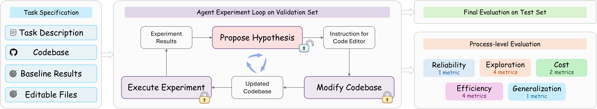

<p align="center">
  <a href="https://github.com/qrzou/FML-bench">
    
  </a>
</p>

<p align="center">
    <a href="http://www.apache.org/licenses/LICENSE-2.0">
        
    </a>
</p>

> **Note:** Paper link [arxiv:2605.17373](https://arxiv.org/abs/2605.17373). The previous version ([arxiv:2510.10472](https://arxiv.org/abs/2510.10472)) lives on the [`legacy`](https://github.com/qrzou/FML-bench/tree/legacy) branch.

A benchmark for automatic ML research agents on fundamental machine learning
problems. Agents are given a baseline codebase, evaluation harness, and task
description, and are asked to iteratively improve the baseline.

<p align="center">
    
</p>


## Contents

- [Quick Start](#quick-start)
- [Setup](#setup)
- [Run an agent (example)](#run-an-agent-example)
- [Run with other models](#run-with-other-models)
- [Run on other tasks](#run-on-other-tasks)
- [FML-bench-Lite](#fml-bench-lite)
- [Remote GPU execution (Modal)](#remote-gpu-execution-modal)
- [Score a run](#score-a-run)
- [Available agents](#available-agents)
- [Repository layout](#repository-layout)
- [Citation](#citation)
- [Acknowledgements](#acknowledgements)


## Quick Start

Install everything (task repos, datasets, conda envs):

```bash
python setup.py
```

Run an agent (e.g. AI Scientist v2 on Causality_causalml with GPT-5.4):

```bash
conda activate fmlbench
export OPENAI_API_KEY="your_openai_api_key"
python run_agent_benchmark.py \
    --agent-config configs/agents/ai_scientist_v2.yaml \
    --task-config  configs/tasks/causality_causalml.yaml \
    --model gpt-5.4 --provider OpenAI \
    --output-dir results \
    agent.ai_scientist_v2.max_steps=100
```

See [Setup](#setup) and [Run an agent (example)](#run-an-agent-example) for full instructions (per-task setup, GPU selection, other providers).


## Setup

Make sure you have Anaconda/Miniconda installed before running setup.

Everything — task repositories, datasets, and the conda environments required
to run agents — is bootstrapped by a single command:

```bash
python setup.py
```

`setup.py` is idempotent: re-running it skips repos, datasets, and envs that
are already present.

If you only want to set up a single task (much faster — only the conda
environments that task needs are created), pass `--task`:

```bash
python setup.py --task Causality_causalml
```

Other options:

```bash
python setup.py --list           # list all available tasks
python setup.py --skip-data      # clone repos and create envs, but skip dataset downloads
python setup.py --skip-envs      # set up workspaces only, skip conda env creation
```

After setup completes, the harness env `fmlbench` is ready, and each task has
its own conda env (e.g. `causalml`, `domainbed`, …) used to execute the
baseline code.


## Run an agent (example)

This example runs **AI Scientist v2** on **Causality_causalml** using
**GPT-5.4**.

```bash
# 1. set up just this task
python setup.py --task Causality_causalml

# 2. activate the harness env
conda activate fmlbench

# 3. provide your API key
export OPENAI_API_KEY="your_openai_api_key"

# 4. pick a GPU
export CUDA_VISIBLE_DEVICES=0

# 5. run the agent
python run_agent_benchmark.py \
    --agent-config configs/agents/ai_scientist_v2.yaml \
    --task-config  configs/tasks/causality_causalml.yaml \
    --model        gpt-5.4 \
    --provider     OpenAI \
    --output-dir   results \
    agent.ai_scientist_v2.max_steps=100
```

Results, the per-step token usage, and a `summary.json` are written under
the chosen `--output-dir` (defaults to `benchmark_results/`); per-agent
step budget is controlled by the `agent.<type>.max_steps=N` override (the
example above sets it to 100).


## Run with other models

The model and provider are command-line flags. Anything supported by the
provider works (e.g. OpenAI GPT family, Google Gemini, Anthropic Claude,
OpenRouter passthrough). Examples:

```bash
# Gemini 2.5 Pro via Google
python run_agent_benchmark.py \
    --agent-config configs/agents/ai_scientist_v2.yaml \
    --task-config  configs/tasks/causality_causalml.yaml \
    --model gemini-2.5-pro --provider Google \
    --output-dir results \
    agent.ai_scientist_v2.max_steps=100

# Claude via OpenRouter
python run_agent_benchmark.py \
    --agent-config configs/agents/ai_scientist_v2.yaml \
    --task-config  configs/tasks/causality_causalml.yaml \
    --model anthropic/claude-3.5-sonnet --provider OpenRouter \
    --output-dir results \
    agent.ai_scientist_v2.max_steps=100
```

Set the corresponding API key in your shell:

| Provider     | Environment variable        |
|--------------|-----------------------------|
| OpenAI       | `OPENAI_API_KEY`            |
| Google       | `GOOGLE_API_KEY`            |
| Anthropic    | `ANTHROPIC_API_KEY`         |
| OpenRouter   | `OPENROUTER_API_KEY`        |

Per-agent hyperparameters can be overridden inline via positional `key=value`
arguments, e.g.:

```bash
python run_agent_benchmark.py \
    --agent-config configs/agents/ai_scientist_v2.yaml \
    --task-config  configs/tasks/causality_causalml.yaml \
    --model gpt-5.4 --provider OpenAI \
    --output-dir results \
    agent.ai_scientist_v2.max_steps=100 \
    agent.ai_scientist_v2.num_ideas=5 \
    agent.ai_scientist_v2.max_debug_depth=2
```


## Run on other tasks

Each task has a YAML in `configs/tasks/`. Set up the workspace for the task,
then point `--task-config` at the corresponding file. For example, to run on
DomainBed (Generalization):

```bash
python setup.py --task Generalization_domainbed
python run_agent_benchmark.py \
    --agent-config configs/agents/ai_scientist_v2.yaml \
    --task-config  configs/tasks/generalization.yaml \
    --model gpt-5.4 --provider OpenAI \
    --output-dir results \
    agent.ai_scientist_v2.max_steps=100
```

Available task configs (one per task):

| Task                                     | Config file                                             |
|------------------------------------------|---------------------------------------------------------|
| Causality (CausalML)                     | `configs/tasks/causality_causalml.yaml`                 |
| Causality (gCastle)                      | `configs/tasks/causality_gcastle.yaml`                  |
| Continual Learning (continual-learning)  | `configs/tasks/continual_learning.yaml`                 |
| Continual Learning (PyCIL)               | `configs/tasks/continual_learning_pycil.yaml`           |
| Data Efficiency (easy-few-shot-learning) | `configs/tasks/data_efficiency.yaml`                    |
| Data Efficiency (USB)                    | `configs/tasks/data_efficiency_usb.yaml`                |
| Fairness (AIF360)                        | `configs/tasks/fairness_and_bias_aif360.yaml`           |
| Fairness (Fairlearn)                     | `configs/tasks/fairness_fairlearn.yaml`                 |
| Federated Learning (PFLlib)              | `configs/tasks/federated_learning_pfllib.yaml`          |
| Generalization (DomainBed, ColoredMNIST) | `configs/tasks/generalization.yaml`                     |
| Generalization (DomainBed, OfficeHome)   | `configs/tasks/generalization_officehome.yaml`          |
| Privacy (Opacus)                         | `configs/tasks/privacy_opacus.yaml`                     |
| Privacy (PrivacyMeter)                   | `configs/tasks/privacy_privacymeter.yaml`               |
| Representation Learning (Lightly)        | `configs/tasks/representation_learning.yaml`            |
| Representation Learning (solo-learn)     | `configs/tasks/representation_learning_solo_learn.yaml` |
| Robustness (ART)                         | `configs/tasks/robustness_and_reliability_art.yaml`     |
| Robustness (OpenOOD)                     | `configs/tasks/robustness_openood.yaml`                 |
| Unlearning (open-unlearning)             | `configs/tasks/unlearning_open_unlearning.yaml`         |

`python setup.py --list` prints the task names accepted by `--task`.


## FML-bench-Lite

**FML-bench-Lite** is a subset of the full benchmark, offered as a cheaper proxy
for the full 18-task suite.

| Task                                     | Config file                                         |
|------------------------------------------|-----------------------------------------------------|
| Continual Learning (PyCIL)               | `configs/tasks/continual_learning_pycil.yaml`       |
| Data Efficiency (USB)                    | `configs/tasks/data_efficiency_usb.yaml`            |
| Generalization (DomainBed, ColoredMNIST) | `configs/tasks/generalization.yaml`                 |
| Generalization (DomainBed, OfficeHome)   | `configs/tasks/generalization_officehome.yaml`      |
| Robustness (OpenOOD)                     | `configs/tasks/robustness_openood.yaml`             |
| Privacy (Opacus)                         | `configs/tasks/privacy_opacus.yaml`                 |
| Privacy (PrivacyMeter)                   | `configs/tasks/privacy_privacymeter.yaml`           |
| Robustness (ART)                         | `configs/tasks/robustness_and_reliability_art.yaml` |

Run an agent on these task configs and [score](#score-a-run) it exactly as you
would the full suite. **Continual Learning (continual-learning)** and **Unlearning
(open-unlearning)** tasks are not suitable as subset tasks due to high variance and large metric scale.
On this subset the overall ranking of agents closely tracks
what the full 18-task benchmark shows, making Lite a useful, cheaper proxy when a
full sweep is out of reach.


## Remote GPU execution (Modal)

By default evaluations run as local subprocesses on this machine. FML-bench also
supports an **opt-in [Modal](https://modal.com) backend** that offloads only the
experiment-execution step (each task's validation/test command) to an ephemeral
remote GPU sandbox, while the entire agent loop — search, code edits, metric
parsing — stays local. This lets you run on remote GPUs and fan many tasks out
in parallel, with no change to agent or task behavior.

That backend lives on its own branch and does not affect the local default on
this branch. For setup and usage, see the
[`Modal` branch](https://github.com/qrzou/FML-bench/tree/Modal).


## Score a run

After an agent has run on all 18 tasks under a single `--output-dir`, score it
with `compute_agent_metrics.py`. Point the script at that agent's result
directory — `<output-dir>/<agent_name>`, which holds one subdirectory per task:

```bash
conda activate fmlbench
python compute_agent_metrics.py results/ai_scientist_v2
```

It prints and writes three tables (as CSVs under `metric_reports/<agent_name>/`
by default; override the location with `--output-dir`):

1. **Raw Performance** — the canonical test metric for each task.
2. **Normalized Improvement** — each task's improvement over its baseline,
   normalized to `[0, 1]` and averaged across tasks.
3. **Process-Level metrics** — 12 metrics spanning Exploration, Generalization,
   Reliability, Efficiency, and Cost.

The 4 Exploration metrics embed each step's code snapshot with GraphCodeBERT and
additionally require `torch`, `transformers`, and `scikit-learn` (embeddings are
cached under the output dir). They read each task's baseline code from
`workspace/`, so that workspace must be at its reset (baseline) state when
scoring. The script only reads from the result directory and refuses an
`--output-dir` that is, or is nested inside, the result directory.


## Available agents

Seven agents are registered in this benchmark. Each has a config in
`configs/agents/`:

| Agent                 | Config file                                    |
|-----------------------|------------------------------------------------|
| The AI Scientist v1   | `configs/agents/theaiscientist.yaml`           |
| The AI Scientist v2   | `configs/agents/ai_scientist_v2.yaml`          |
| AIDE                  | `configs/agents/aide.yaml`                     |
| AIRA                  | `configs/agents/aira_mcts.yaml`                |
| Autoresearch          | `configs/agents/autoresearch.yaml`             |
| OpenEvolve            | `configs/agents/openevolve.yaml`               |
| AdaptiveSearch (ours) | `configs/agents/adaptivesearch.yaml`           |

Swap `--agent-config` to switch agents — everything else (task, model,
provider) stays the same.


## Repository layout

```
setup.py                  # one-shot environment + workspace setup
run_agent_benchmark.py    # entry point for running an agent on a task
compute_agent_metrics.py  # score one agent's results (3 tables + CSVs)
agents/                   # agent implementations
benchmark/                # benchmark runner / executor
configs/agents/           # agent YAMLs
configs/tasks/            # task YAMLs
ml_tasks/                 # task definitions: train.py, prompts, configs
workspace/                # populated by setup.py with task codebases
```


## Citation

If you find FML-bench useful in your research, please cite our paper:

```bibtex
@article{zou2026fml,
  title={FML-bench: A Controlled Study of AI Research Agent Strategies from the Perspective of Search Dynamics},
  author={Zou, Qiran and Lam, Hou Hei and Zhao, Wenhao and Chen, Tingting and Tang, Yiming and Yu, Samson and Zhu, Yingtao and Anumasa, Srinivas and Zhang, Zufeng and Zhang, Tianyi and others},
  journal={arXiv preprint arXiv:2605.17373},
  year={2026}
}
```


## Acknowledgements

We thank the maintainers of the following upstream projects:

- **ML Repos:** [DomainBed](https://github.com/facebookresearch/DomainBed), [easy-few-shot-learning](https://github.com/sicara/easy-few-shot-learning), [USB](https://github.com/microsoft/Semi-supervised-learning), [Lightly](https://github.com/lightly-ai/lightly), [solo-learn](https://github.com/vturrisi/solo-learn), [continual-learning](https://github.com/GMvandeVen/continual-learning), [PyCIL](https://github.com/LAMDA-CL/PyCIL), [CausalML](https://github.com/uber/causalml), [gCastle](https://github.com/huawei-noah/trustworthyAI), [Adversarial Robustness Toolbox](https://github.com/Trusted-AI/adversarial-robustness-toolbox), [OpenOOD](https://github.com/Jingkang50/OpenOOD), [Opacus](https://github.com/pytorch/opacus), [PrivacyMeter](https://github.com/privacytrustlab/ml_privacy_meter), [AIF360](https://github.com/Trusted-AI/AIF360), [Fairlearn](https://github.com/fairlearn/fairlearn), [PFLlib](https://github.com/TsingZ0/PFLlib), [open-unlearning](https://github.com/locuslab/open-unlearning)
- **ML Research Agents:** [The AI Scientist v1](https://github.com/SakanaAI/AI-Scientist), [The AI Scientist v2](https://github.com/SakanaAI/AI-Scientist-v2), [AIDE](https://github.com/WecoAI/aideml), [AIRA](https://github.com/facebookresearch/aira-dojo), [Autoresearch](https://github.com/karpathy/autoresearch), [OpenEvolve](https://github.com/codelion/openevolve)
